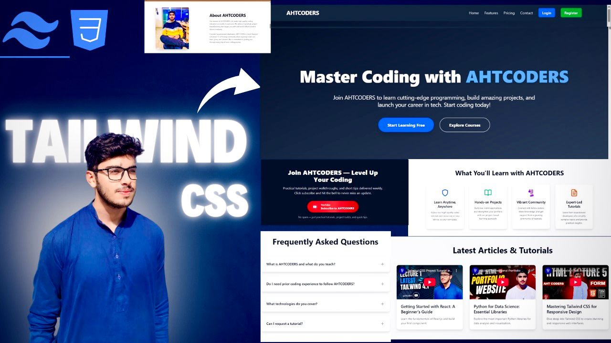

# 🚀 AHTCODERS - Master Coding Website with Tailwind CSS

This project is a modern, responsive **coding education website** built using **Tailwind CSS**.  
It showcases clean UI, reusable components, and a professional layout suitable for coding tutorials, tech blogs, and online learning platforms.

## ✨ Features
- 🔹 Responsive design with Tailwind CSS
- 🔹 Hero section with call-to-action buttons
- 🔹 About section
- 🔹 FAQ section with collapsible items
- 🔹 Course features section
- 🔹 Blog/Articles & Tutorials section
- 🔹 Login & Register buttons with modern UI
- 🔹 Contact Form
- 🔹 Subscribe Section
- 🔹 Footer

## 🛠️ Technologies Used
- **HTML5**
- **CSS3**
- **Tailwind CSS**

🌐 Live Demo

👉 View Live Project

https://ahttailwindproject.vercel.app/

📩 Contact

If you like this project, don’t forget to star ⭐ the repo and subscribe to my YouTube Channel.
https://www.youtube.com/@AHTCoders

📢 Contributing

Pull requests are welcome. For major changes, please open an issue first to discuss what you’d like to change.


## 📸 Preview


## 🚀 Getting Started
1. Clone the repository:
   ```bash
   git clone https://github.com/ChaudharyAkif/tailwindcss-Project.git

